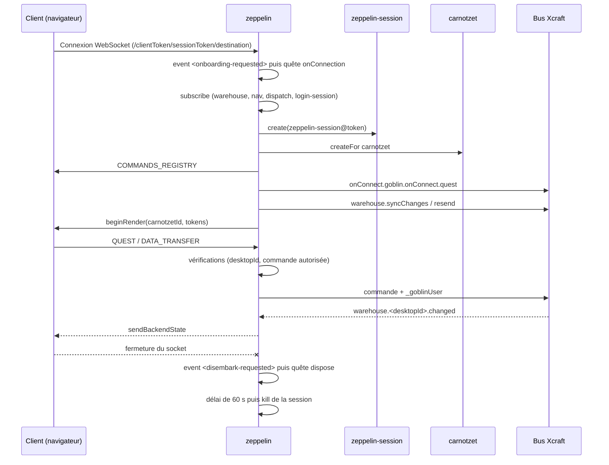

# 📘 goblin-zeppelin

## Aperçu

`goblin-zeppelin` est la passerelle WebSocket entre les interfaces web (navigateurs) et le bus Xcraft. Il expose un serveur WebSocket qui accueille les « passagers » (clients UI), leur crée une session dédiée, un bureau (`desktop`) et un laboratoire (`carnotzet`), puis relaie dans les deux sens les quêtes, les états du backend et les actions de navigation. Il filtre également les commandes que le client est autorisé à envoyer sur le bus.

## Sommaire

- [Aperçu](#aperçu)
- [Structure du module](#structure-du-module)
- [Fonctionnement global](#fonctionnement-global)
- [Exemples d'utilisation](#exemples-dutilisation)
- [Interactions avec d'autres modules](#interactions-avec-dautres-modules)
- [Configuration avancée](#configuration-avancée)
- [Détails des sources](#détails-des-sources)
- [Licence](#licence)

## Structure du module

Le module expose deux points d'entrée `xcraftCommands` à sa racine, chargés dynamiquement par [xcraft-core-server] au démarrage et enregistrés sur le bus via [xcraft-core-bus] :

- **`zeppelin.js`** → `lib/service.js` : acteur **Goblin** singleton `zeppelin`, qui gère le serveur WebSocket, l'onboarding des clients et le relais des messages.
- **`zeppelin-session.js`** → `lib/zeppelin-session.js` : acteur **Goblin** instanciable `zeppelin-session`, qui persiste les préférences d'interface d'une session (colonnes, dialogues, thème, langue, etc.).
- **`lib/buildCommandsFilter.js`** : utilitaire de filtrage et d'expansion des commandes autorisées.
- **`config.js`** : options de configuration exploitées via [xcraft-core-etc].

Les deux acteurs sont de type **Goblin** (pas de classes, `Goblin.configure`) : leurs quêtes sont donc enregistrées avec `Goblin.registerQuest`.

## Fonctionnement global

### Vue d'ensemble

1. Au démarrage, la quête `init` de `zeppelin` ouvre un serveur WebSocket (via `ws`), soit sur un serveur HTTP existant (`server`), soit sur `host`/`port`.
2. À chaque connexion, un événement `greathall::zeppelin.<onboarding-requested>` est émis ; il déclenche la quête `onConnection`.
3. `onConnection` négocie les jetons (client / session), calcule les identifiants (`zeppelin-session@…`, `desktop@…`, `carnotzet@…`), crée la session et le carnotzet, envoie au client la liste des commandes autorisées (`COMMANDS_REGISTRY`) puis lance le rendu (`beginRender`).
4. Les messages entrants (`QUEST`, `DATA_TRANSFER`, `RESEND`) sont validés (desktopId, commande autorisée) puis relayés sur le bus, en injectant l'identité de l'utilisateur (`_goblinUser`).
5. Les changements d'état du warehouse concernant le desktop sont poussés vers le client (`sendBackendState`).
6. À la fermeture du socket, un événement `<disembark-requested>` déclenche la quête `dispose`. La session n'est détruite qu'après un délai de grâce de 60 secondes, ce qui permet à un client qui se reconnecte rapidement de retrouver sa session.

### Diagramme de séquence



### Gestion des jetons et des sessions

- L'URL de connexion a la forme `/<clientToken>/<sessionToken>/<destination>`.
- Si le cookie `epsitec-client-token` est présent, il remplace le `clientToken` et sert aussi de jeton de session de login (`loginSessionToken`).
- Un `clientToken` valant `new-token` est remplacé par un jeton généré.
- Le `sessionToken` n'est conservé que si une déconnexion récente est en attente de destruction pour ce jeton ; dans tous les autres cas, un nouveau jeton est généré. Si le jeton est déjà marqué comme « à tuer », un nouveau jeton est également généré.
- Une connexion concurrente sur le même `socketId` est sérialisée par un mutex (`locks.getMutex`).

### Sécurité et filtrage

Pour chaque message `QUEST` ou `DATA_TRANSFER` :

- **Sans `desktopId`** : l'événement est journalisé (`OVERWATCH`) mais le message reste accepté (la coupure est désactivée dans le code, avec un TODO).
- **`desktopId` différent** de celui de la session : le socket est terminé et la session libérée.
- **Commande non autorisée** (selon `allowedCommands`) : le socket est terminé et la session libérée.

Par ailleurs, la propriété `_goblinUser` éventuellement fournie par le client est supprimée avant d'être réinjectée côté serveur, ce qui empêche l'usurpation d'identité.

Le blocage « overwatch » n'est pour l'instant qu'un message d'avertissement dans la console (service de sécurité non implémenté).

## Exemples d'utilisation

### Démarrer la passerelle (acteur Goblin singleton)

```javascript
// Depuis une quête d'un autre Goblin
yield quest.cmd('zeppelin.init', {
  id: 'zeppelin',
  theme: 'default',
  themeContexts: ['theme-context@default'],
  feeds: [],
  onConnect: {goblin: 'my-app', quest: 'onConnect', goblinId: 'my-app'},
  onBeginRender: {goblin: 'my-app', quest: 'onBeginRender', goblinId: 'my-app'},
  onDisconnect: {goblin: 'my-app', quest: 'onDisconnect', goblinId: 'my-app'},
  host: '0.0.0.0',
  port: 8000,
});
```

Les trois callbacks (`onConnect`, `onBeginRender`, `onDisconnect`) désignent une quête (`goblin` + `quest`) et l'identifiant de l'instance (`goblinId`) à appeler à chaque étape du cycle de vie d'un client. Elles reçoivent notamment `labId`, `desktopId` et `tokens`.

### Persister une préférence d'interface

```javascript
const sessionId = `zeppelin-session@${sessionToken}`;

yield quest.cmd('zeppelin-session.set-view-column-width', {
  id: sessionId,
  viewId: 'orders-view',
  columnId: 'customer',
  width: 240,
});

const theme = yield quest.cmd('zeppelin-session.get-theme', {id: sessionId});
```

### Restreindre les commandes accessibles depuis le navigateur

Dans la configuration (voir [Configuration avancée](#configuration-avancée)) :

```json
{
  "allowedCommands": [
    "(laboratory|carnotzet).(how|when)-(ui|test)-crash",
    "my-app.*"
  ]
}
```

Les groupes `(a|b)` sont développés par `buildAllowedCommandsList`, qui produit la liste explicite des commandes envoyée au client.

## Interactions avec d'autres modules

- [xcraft-core-goblin] : fournit `Goblin`, le warehouse (`quest.warehouse`) et le système de quêtes sur lequel reposent les deux acteurs.
- [goblin-laboratory] : fournit `WebSocketChannel`, utilisé pour dialoguer avec le client (envoi d'actions, états du backend, démarrage du rendu).
- [xcraft-core-busclient] : création des réponses (`newResponse`) utilisées pour émettre des événements et envoyer des commandes.
- [xcraft-core-transport] : décodage des messages JSON Xcraft (`helpers.fromXcraftJSON`).
- [xcraft-core-utils] : génération de jetons (`crypto.genToken`), mutex (`locks`) et conversion des règles de commandes en expressions régulières (`regex.toXcraftRegExpStr`).
- [xcraft-core-etc] : chargement de la configuration du module.
- [xcraft-core-bus] et [xcraft-core-server] : chargement des commandes exportées par `zeppelin.js` et `zeppelin-session.js`.
- [goblin-nabu] : utilisé par `zeppelin-session` pour résoudre la meilleure locale (`findBestLocale`, `getFirstLocale`) et déduire la langue.
- **carnotzet** et **desktop** : acteurs créés ou référencés pour chaque session cliente.
- **login-session** : si un jeton de login est connu, `zeppelin` suit son état (`login-state-changed`) pour construire l'identité de l'utilisateur.

## Configuration avancée

| Option            | Description                                                   | Type   | Valeur par défaut                     |
| ----------------- | ------------------------------------------------------------- | ------ | ------------------------------------- |
| `allowedCommands` | Liste des commandes autorisées (motifs avec groupes `(a\|b)`) | list   | `[]` (toutes les commandes acceptées) |
| `host`            | Adresse d'écoute du serveur WebSocket                         | string | `null` (repli : `0.0.0.0`)            |
| `port`            | Port d'écoute du serveur WebSocket                            | string | `null` (repli : `8000`)               |

Les paramètres `host` et `port` passés à la quête `init` ont priorité sur la configuration. Si `server` (serveur HTTP existant) est fourni, le WebSocket s'y attache et `host`/`port` sont ignorés.

## Détails des sources

### `zeppelin.js` et `zeppelin-session.js`

Points d'entrée racine exposant `xcraftCommands`. Ils délèguent respectivement à `lib/service.js` et `lib/zeppelin-session.js`. Le nom de l'acteur (`zeppelin` ou `zeppelin-session`) est déduit du nom du fichier qui les charge.

### `lib/service.js`

Acteur Goblin **singleton** `zeppelin`, créé avec `Goblin.createSingle`. Il n'a pas de widget : c'est le cœur de la passerelle.

**Cycle de vie :**

- **Initialisation** : quête `init`, qui démarre le serveur WebSocket et le « heartbeat » (ping toutes les 30 s, terminaison des sockets qui n'ont pas répondu).
- **Connexion d'un client** : quête `onConnection`.
- **Déconnexion** : quête `dispose`, qui libère les ressources et planifie la destruction différée de la session.

#### État et modèle de données

L'état Goblin ne contient qu'une propriété `sessions` (vide, non exploitée). Les données de travail sont conservées dans le stockage éphémère du Goblin (`setX` / `getX`), indexé par `socketId` :

- `channel@<socketId>` : canal `WebSocketChannel` du client.
- `subs@<socketId>` : fonction de désabonnement de toutes les souscriptions du client.
- `loginState@<socketId>` : état de login (`userId`, `login`, `isLogged`).
- `theme`, `themeContexts` : thème transmis à chaque carnotzet créé.
- `clientTokens`, `sessionTokensToKill`, `sessionKillTimeouts` : gestion des jetons et des délais de destruction.

#### Événements

**Publiés :**

- `greathall::zeppelin.<onboarding-requested>` : nouvelle connexion WebSocket.
- `greathall::zeppelin.<disembark-requested>` : fermeture ou erreur d'un socket.
- `data-transfer.requested` : un client a demandé un transfert de données.

**Souscrits :**

- `greathall::zeppelin.<onboarding-requested>` et `<disembark-requested>` (appellent `onConnection` et `dispose`).
- `*::warehouse.<desktopId>.changed` (renvoyé au client via `sendBackendState`).
- `*::<desktopId>.nav.requested` (appelle la quête `nav`).
- `*::<desktopId>.dispatch.requested` (appelle la quête `dispatch`).
- `*::login-session@<token>.<login-state-changed>` (met à jour l'état de login).

#### Méthodes publiques

- **`init(theme, themeContexts, feeds, onConnect, onBeginRender, onDisconnect, server, host, port)`** — Initialise la passerelle : prépare les structures internes, installe les souscriptions d'onboarding / disembark et démarre le serveur WebSocket. `host` et `port` ont pour repli la configuration, puis `0.0.0.0` et `8000`.
- **`onConnection(req, socket, mandate, feeds, onConnect, onBeginRender, onDisconnect)`** — Onboarding complet d'un client (voir [Fonctionnement global](#fonctionnement-global)). En cas d'échec des callbacks `onConnect` ou `onBeginRender`, le socket est fermé avec le code `4001`.
- **`dispose(socketId, zeppelinSessionId, carnotzetId, desktopId, tokens, onDisconnect)`** — Nettoie les ressources liées au socket, appelle `onDisconnect` si fourni, puis programme la destruction de la session 60 secondes plus tard.
- **`subscribe(socketId, desktopId, loginSessionToken)`** — Installe les souscriptions d'un client. Lève une erreur si le socket est déjà abonné.
- **`nav(desktopId, route)`** — Non implémenté.
- **`dispatch(desktopId, action)`** — Non implémenté.

### `lib/zeppelin-session.js`

Acteur Goblin **instanciable** (`zeppelin-session@<sessionToken>`) qui conserve les réglages d'interface d'un utilisateur pour la durée de sa session. La quête `create` est son constructeur et `delete` son destructeur (vide).

#### État et modèle de données

- `id` : identifiant de la session.
- `locale` : locale active ; `userLocale` : locale de l'utilisateur (déclarée, non modifiée par les handlers présents).
- `theme` et `zoom` : thème et niveau de zoom (le zoom n'apparaît dans l'état qu'après le premier `set-zoom`).
- `views` : réglages des vues par identifiant, avec `widths` (largeur par colonne), `order` (ordre des colonnes) et `sorting` (colonne et direction de tri).
- `tips`, `splitters`, `dialogs` : états des astuces, séparateurs et dialogues, indexés par identifiant.
- `desktopClock` : état de l'horloge du bureau, indexé par thème.
- `translatableTextField` : état des champs de texte traduisibles.
- `lastColorsPicker` : dernières couleurs choisies.
- `accessToEggsThemes` : active l'accès aux thèmes « eggs ».
- `prototypeMode` : mode prototype.

#### Méthodes publiques

- **`create(desktopId)`** — Crée la session et enregistre son identifiant dans l'état.
- **`setLocale(locale, selectedLocale, acceptLanguage)`** — Détermine la meilleure locale (choix explicite, puis en-tête `Accept-Language` trié par qualité, puis première locale disponible) et la stocke.
- **`getLocale()`** — Retourne la locale courante.
- **`change-locale(locale)`** — Raccourci pour changer la locale sélectionnée.
- **`getLanguage()`** — Retourne la langue déduite de la locale courante.
- **`set-theme(theme)`** / **`get-theme()`** — Définit ou lit le thème.
- **`set-zoom(zoom)`** / **`get-zoom()`** — Définit ou lit le zoom.
- **`set-tips(tipsId, state)`**, **`set-splitters(splitterId, state)`**, **`set-dialogs(dialogId, state)`** — Mémorisent l'état d'un élément d'interface.
- **`set-view-column-sorting(viewId, columnId, direction)`** — Mémorise le tri d'une vue.
- **`set-view-column-width(viewId, columnId, width)`** — Mémorise la largeur d'une colonne.
- **`set-view-columns-order(viewId, columnIds)`** — Mémorise l'ordre des colonnes.
- **`reset-view-column(viewId)`** — Supprime tous les réglages d'une vue.
- **`set-desktop-clock(theme, state)`**, **`set-translatable-text-field(state)`**, **`set-last-colors-picker(state)`** — Mémorisent l'état des composants correspondants.
- **`set-access-to-eggs-themes(show)`** — Active ou désactive l'accès aux thèmes « eggs ».
- **`toggle-prototype-mode()`** — Bascule le mode prototype.
- **`delete()`** — Destructeur (sans effet particulier).

### `lib/buildCommandsFilter.js`

Utilitaires de filtrage des commandes :

- **`buildCommandsFilter(rules)`** — Retourne une fonction `(cmd) => boolean` qui vaut `true` si la commande correspond à l'une des règles (converties par `toXcraftRegExpStr`).
- **`buildAllowedCommandsList(commands)`** — Développe récursivement les groupes `(a|b)` et retourne un objet `{commande: true}`. Par exemple, `(laboratory|carnotzet).(how|when)-(ui|test)-crash` produit huit commandes distinctes.
- **`createAllCommandsInGroup(commands)`** — Fonction interne de développement des groupes.

Un bloc commenté en tête de fichier permet de journaliser dans un fichier temporaire toutes les commandes reçues, utile pour établir la liste à autoriser.

## Licence

Ce module est distribué sous [licence MIT](./LICENSE).

_Ce contenu a été généré par IA_

---

[goblin-laboratory]: https://github.com/Xcraft-Inc/goblin-laboratory
[goblin-nabu]: https://github.com/Xcraft-Inc/goblin-nabu
[xcraft-core-bus]: https://github.com/Xcraft-Inc/xcraft-core-bus
[xcraft-core-busclient]: https://github.com/Xcraft-Inc/xcraft-core-busclient
[xcraft-core-etc]: https://github.com/Xcraft-Inc/xcraft-core-etc
[xcraft-core-goblin]: https://github.com/Xcraft-Inc/xcraft-core-goblin
[xcraft-core-server]: https://github.com/Xcraft-Inc/xcraft-core-server
[xcraft-core-transport]: https://github.com/Xcraft-Inc/xcraft-core-transport
[xcraft-core-utils]: https://github.com/Xcraft-Inc/xcraft-core-utils
